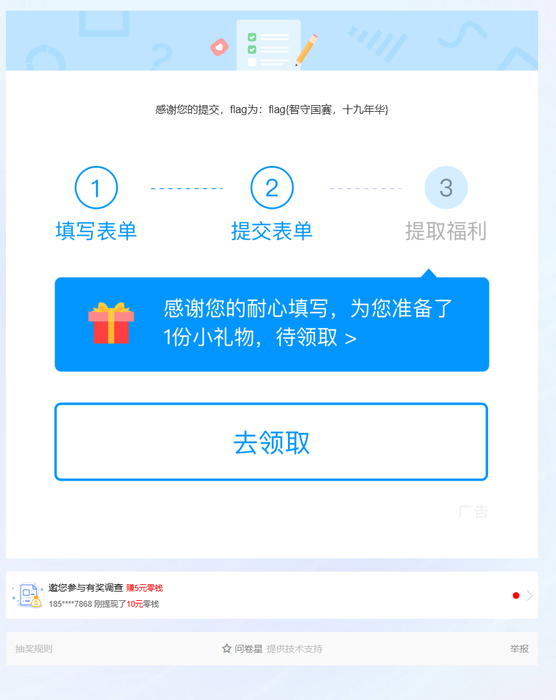

## 安全知识

1、《中华人民共和国数据安全法》正式施行的日期是什么时候？（）
A、2021年6月10日
B、2021年9月1日
C、2021年1月1日
D、2020年12月1日

2、以下哪项属于《数据安全法》立法背景中提到的国际因素？（）
A、国内数据泄露事件频发
B、数字化转型的全球竞争
C、中国网络安全法的修订
D、互联网企业垄断问题

3、中华人民共和国数据安全法一共有多少章多少条规定（）
A、7章40条
B、7章55条
C、6章55条
D、6章40条

4、在《数据安全法》中，哪一章专门涉及政务数据安全与开放？（）
A、第一章 总则
B、第三章 数据安全制度
C、第五章 政务数据安全与开放
D、第六章 法律责任

5、在《数据安全法》立法背景中，提到的国际数据安全法规示例不包括以下哪项？（）
A、欧盟GDPR
B、美国云法案
C、非个人数据自由流动条例
D、中国个人信息保护法

6、根据GB/T 24363-2009《信息安全技术 信息安全应急响应计划规范》，以下哪一项是应急响应流程的正确起始步骤？（）
A、应急启动
B、事件通告
C、事件分类与定级
D、后期处置

7、根据NIST SP 800-61《计算机安全事件处置指南》，应急响应流程中不包含以下哪个阶段？（）
A、准备
B、检测与分析
C、事件分类与定级
D、事后处置

8、在NIST SP 800-61指南中，“建立应急响应小组、建立事件报告机制”属于哪个阶段的活动？（）
A、检测与分析
B、准备
C、遏制、根治和恢复
D、事后处置

9、在GB/T 24363-2009规范的应急响应流程中，“对事件进行抑制，避免更大损失”属于哪个阶段？（）
A、事件通告
B、事件分类与定级
C、应急处置
D、后期处置

10、关于两个标准指南的应急响应流程，以下说法正确的是？（）
A、两个流程的阶段划分和名称完全相同。
B、NIST指南的流程始于“事件分类与定级”。
C、两个流程在本质上都包含了事前准备、事中处置和事后总结的循环。
D、国标流程的最后一步是“事件通告”。

11、2025年10月，中国国家授时中心遭遇高级持续性威胁（APT）攻击。作为国家重大科技基础设施，国家授时中心受到攻击对国家安全产生重要影响。攻击者在攻击中采用了一个关键技术手段：伪造微软认可的数字签名证书，并利用这个伪造的证书对其制作的恶意软件进行签名。这使得恶意软件在目标系统上运行时，能够被系统安全软件（如杀毒软件、Windows Defender）识别为可信合法程序，从而成功绕过了基于代码签名的应用程序控制和白名单机制，实现了隐蔽的初始入侵和持久化控制。 请回答如下问题： 1.APT攻击通常具有哪些典型特点？（）
A、攻击目标明确，具有针对性
B、攻击手段旨在实现初始入侵和长期持久化驻留
C、攻击使用复杂和高超的技术手段
D、攻击目的在于最短时间内造成系统瘫痪

2.攻击者利用恶意软件实现持久化控制可能通过哪些方式？（）
A、注册系统服务
B、植入计划任务
C、自动关闭杀毒软件
D、替换系统关键文件

3.假设你是安全分析师，复盘此次攻击。攻击者成功利用伪造证书的恶意软件实现初始入侵后，为了将窃取的敏感数据外传，他们最可能采用以下哪几种技术以规避检测？（）
A、将数据压缩后分块通过FTP协议传输到公共云存储
B、采用DNS隧道技术，将数据隐藏在DNS查询和响应包中
C、使用基于HTTP/HTTPS的加密信道，将数据伪装成正常的Web浏览流量
D、使用ICMP隧道或数据分片技术，将数据负载隐藏在非TCP/UDP协议中

4.在电子邮件和文档安全方面，数字签名证书的应用可以实现哪些安全目标？ A.收件人可以确信邮件确实来自声称的发件人，而非钓鱼邮件。（）
A、收件人可以确信邮件确实来自声称的发件人，而非钓鱼邮件。
B、可以自动对邮件正文和附件进行高强度加密，确保只有收件人能阅读。
C、收件人可以验证邮件自发出后，内容未被中间人篡改。
D、在法律上，可以作为证据证明发件人确实发送了该邮件，发件人无法抵赖。

5.该攻击案例利用了现有安全机制中的哪些信任假设？（）
A、微软可验证签名的程序是安全可信的
B、数字签名证书的私钥不可能被伪造
C、白名单机制内的程序都是无害的
D、网络防火墙能够阻断所有外部攻击

12、某品牌的智能家居摄像头被曝存在一个高危漏洞，该漏洞允许攻击者通过特制的网络数据包远程执行代码。由于该型号摄像头数量庞大且多数用户未更新固件，攻击者编写了自动化脚本，在互联网上大规模扫描并利用此漏洞。成功入侵后，攻击者在摄像头内植入僵尸网络程序，将其纳入一个庞大的“肉鸡”网络，并利用这个网络发动了对某国政府网站的大规模分布式拒绝服务（DDoS）攻击。 请回答如下问题： 1.此次攻击利用了物联网安全的哪些弱点？（）
A、设备缺乏物理安全防护
B、设备固件升级过程未使用加密通信
C、设备普遍缺乏有效的安全更新机制，导致已知漏洞长期存在
D、设备普遍暴露在公网，易于被扫描发现

2.为组建一个稳定的僵尸网络以发动DDoS攻击，攻击者植入的程序可能需要具备哪些功能？（）
A、与命令与控制（C&C）服务器通信
B、接收攻击指令并执行
C、隐藏自身进程，避免被用户发现
D、能够横向移动感染局域网内其他设备

3.从防御角度看，网络服务提供商（ISP）有可能通过哪些技术手段监测和缓解此类源自物联网设备的DDoS攻击？（）
A、在骨干网层面部署流量清洗系统
B、分析网络流量，识别异常连接模式和流量峰值
C、根据流量特征自动生成并下发ACL规则阻断恶意流量
D、直接远程修复用户摄像头中的漏洞

4.为什么实施“最小权限原则”能够降低此类僵尸程序控制设备后所造成的安全风险？（）
A、即使设备被控，僵尸程序也因权限不足而无法进行某些敏感操作
B、能有效减少设备暴露在公网的攻击面，使扫描器更难发现
C、能够限制僵尸程序对设备其他部分和网络资源的访问
D、确保设备固件自动更新

5.一家企业如果在其办公区域使用了同款摄像头，它面临的安全风险有哪些？（）
A、摄像头成为攻击者进入企业内网的跳板
B、摄像头被控后，可能被利用从内部对企业网络关键基础设施（如网关、服务器）发起DDoS攻击
C、办公区域的隐私视频可能被窃取
D、企业核心数据库的登录凭证可利用该漏洞从内存中直接获取

13、某跨国企业CFO在出差期间，接到一个显示为CEO姓名的视频通话。通话中，“CEO”的面部表情、声音语调与本人无异，他声称正在处理一项高度机密的紧急收购案，要求CFO立即向一个指定海外账户转账500万美元。为增加可信度，“CEO”还通过一个仿冒的内部审批系统发送了带有伪造数字签名的“授权文件”。CFO信以为真，执行了转账操作。事后调查发现，攻击者利用从社交媒体上采集的公开视频和音频，训练了一个深度伪造模型，合成了此次视频通话；同时，他们仿冒了公司的OA系统并盗用了一名已离职IT员工的VPN凭证以接入内网发送邮件。 请回答如下问题： 1.深度伪造技术在此次攻击中主要破坏了信息安全的哪些属性？（）
A、机密性
B、完整性
C、可用性
D、真实性

2.攻击者盗用已离职员工VPN凭证的行为，暴露了企业在身份与访问管理（IAM）上哪些常见问题？（）
A、离职员工账户未能及时禁用
B、缺乏多因素认证等强认证机制
C、VPN账户权限过大，未遵循最小权限原则
D、对异常地点/设备的登录行为缺乏监控

3.从取证角度，调查此类深度伪造攻击可能涉及分析哪些数字证据？（）
A、视频文件元数据及编码特征
B、网络流量数据包，追溯通话来源
C、视频中人物的视网膜反射图像，用于精确定位攻击者的物理位置
D、伪造文件的数字签名信息

4.在此次攻击中，攻击者成功利用了哪些类型的安全漏洞？（）
A、公司对高额转账缺乏多因素认证或二次确认机制
B、CFO受到了社会工程学攻击
C、公司数据中心门禁系统存在缺陷，允许未授权进入
D、CFO在公司系统使用了弱密码，且未定期更换

5.关于虚拟专用网络（VPN）技术，以下哪些描述是正确的？（）
A、IPSec协议簇工作在网络层，可以对整个IP数据包（包括载荷和原始IP头）进行加密和认证，非常适合构建站点到站点（Site-to-Site）的VPN
B、SSL/TLS VPN的一种典型应用是用户无需安装专用客户端，即可通过Web浏览器建立安全连接，访问组织内部Web资源
C、远程访问VPN允许移动用户通过模拟“内部网络直接连接”的方式，安全地访问组织内部的资源。
D、VPN连接建立后，用户设备的其它网络端口会自动关闭，避免来自互联网的入站攻击。

14、某企业部署了基于网络和主机的混合入侵检测架构，其中网络入侵检测系统（NIDS）采用基于特征的检测模式，主机入侵检测系统（HIDS）采用异常行为基线分析，同时集成了威胁情报平台（TIP）进行实时规则更新。 近期系统多次触发告警，部分日志如下：  NIDS告警：  告警1：源IP 192.168.1.100 向目标IP 10.0.0.5:22 发起连续5次SSH暴力破解尝试（特征ID：SSH-BF-001）。  告警2：源IP 203.0.113.25 向目标IP 10.0.0.10:80 发送包含SQL注入 payload ' OR '1'='1 的HTTP请求（特征ID：SQLi-007）。  HIDS告警：  告警3：服务器10.0.0.5的 /etc/passwd 文件在非工作时间（凌晨2:30）被修改，且修改操作是由非特权账户“webuser”执行的（基线偏差率：95%）  告警4：服务器10.0.0.10的进程nginx异常创建子进程 bash（基线偏差率：88%）。 威胁情报平台显示203.0.113.25为已知恶意IP，且该企业网络边界防火墙已拦截 203.0.113.25的后续连接。192.168.1.100为员工办公终端，192.168.1.100的连接没有被拦截。 请回答如下问题： 1.根据告警日志和背景信息，下列哪些选项是正确的？（）
A、服务器10.0.0.5的SSH服务对应的端口为22
B、源IP 203.0.113.25的攻击已被阻止，无需进一步处理
C、服务器10.0.0.5可能存在权限提升风险，需检查 webuser 账户
D、服务器10.0.0.10的 nginx 进程行为正常，属于误报

2.关于NIDS告警2（SQL注入）及现有信息，以下哪些分析是合理的？（）
A、该告警中攻击 payload 的核心作用是触发服务器缓冲区溢出漏洞
B、SQL注入攻击来自已知恶意IP 203.0.113.25，意味着该IP曾被记录发起过网络攻击
C、由告警信息可推断攻击者的最终目标是获取管理员账户密码
D、边界防火墙拦截了IP 203.0.113.25的后续连接，成功阻断了此次SQL注入攻击

3.若需验证告警2中SQL注入攻击是否成功，可采集的证据有哪些？（）
A、核查威胁情报平台（TIP），确认源IP 203.0.113.25是否被标记为“恶意”
B、检查服务器10.0.0.10的数据库进程是否在攻击时段内执行了包含' OR '1'='1条件的异常查询
C、检查Web服务器10.0.0.10的应用日志，确认该注入请求是否返回了“200 OK”状态码而非“500 服务器错误”
D、检查防火墙日志，确认源IP 203.0.113.25的后续连接是否已被成功拦截

4.关于NIDS告警1（SSH暴力破解）和现有信息，以下哪些说法是正确的？（）
A、此攻击源自企业内部网络，表明可能是一台已失陷的员工终端
B、由于攻击源是内部IP，边界防火墙无法有效阻止此攻击
C、威胁情报平台标记该IP为良性，因此这是一个误报，可以忽略
D、应立刻检查主机10.0.0.5的SSH认证日志，以确认暴力破解是否成功

5.将告警1（SSH暴力破解）和告警3（/etc/passwd被修改）关联分析，可以做出以下哪些合理推测？（）
A、服务器10.0.0.5上的Web应用可能存在漏洞，被攻击者利用
B、攻击者可能成功破解了服务器10.0.0.5上某个账户的SSH密码
C、两个告警针对同一目标IP，存在明显的攻击升级路径，需要优先处理
D、如果TIP提供的威胁情报包含“攻击团伙X常使用修改/etc/passwd”的方法进行“持久化”这一行为模式，那么该情报可以直接转化为HIDS的检测规则，并用于发现告警3中的行为

## Web安全

 JavaSql

题目内容：SQL注入但是Java

[附件下载](https://pan.baidu.com/s/1e5l_-O2bJH6mqlrnmohujQ) 提取码（GAME）[备用下载](https://share.weiyun.com/ThICYL8D)

0o0o0o0o0

题目内容：小明最近开设了一个新的网站，当时该网站存在安全风险，请你帮小明排查网站存在的 users 和 datas 的风险。（本题下发后，请通过http访问相应的ip和port，例如 nc ip port ，改为[http://ip:port/](http://ip:port/) ）

AI_WAF

题目内容：小路想获取NexaData公司储存的秘密，但是该公司的网站使用了AI的WAF进行防护，小路看到WAF后一脸懵逼，所以来找你求救，你能帮助她吗?（本题下发后，请通过http访问相应的ip和port，例如 nc ip port ，改为[http://ip:port/](http://ip:port/) ）

complexweb

题目内容：（本题下发后，请通过http访问相应的ip和port，例如 nc ip port ，改为[http://ip:port/）](http://ip:port/%EF%BC%89)

Deprecated

题目内容：

[附件下载](https://pan.baidu.com/s/13CqZJ-_O-scwKkBoNKk39g) 提取码（GAME）[备用下载](https://share.weiyun.com/7OpkbnHu)

Easy_search

题目内容：小明在浏览网站的时候发现查询的时候会触发403，直觉告诉他这里有问题，你能找到403后面隐藏的问题吗？

EzJava

题目内容：公告管理系统近期开发测试，为保证测试环境安全，已把常用系统命令全部清除，请尝试读取根目录的敏感文件。（本题下发后，请通过http访问相应的ip和port，例如 nc ip port ，改为[http://ip:port/](http://ip:port/) ）

hellogate

题目内容：

hjppx

题目内容：小明在服务器上下载了一堆奇怪的东西，请帮忙排查一下该功能是否存在问题？

redjs

题目内容：小明在服务器上部署了一个常用的框架，请你帮忙看看是否有问题。

dedecms

题目内容：5.7sp2

## PWN

robo

题目内容：真的有点粗心呢～

[附件下载](https://pan.baidu.com/s/11cDage-nedAYcUe8OK7jvQ) 提取码（GAME）[备用下载](https://share.weiyun.com/9d0nQZrY)

easy_rw

题目内容：在一次漏洞扫描中，你的团队扫到了目标团伙的一个直播平台，听说你是 PWN 高手，给你一天时间把这个站点拿下。

[附件下载](https://pan.baidu.com/s/1SAIoMGZPvgNDdsmUf_IHHA) 提取码（GAME）[备用下载](https://share.weiyun.com/2Vux6mJf)

ram_snoop

题目内容：That’s where the flag is hidden.

[附件下载](https://pan.baidu.com/s/1Lm4vG7YJORlkIxpegoIuNQ) 提取码（GAME）[备用下载](https://share.weiyun.com/U3OmHd6L)

minihttpd

题目内容：小A刚参加工作不久，接到任务需要用C语言给一款嵌入式设备开发一个http服务端，用于业务通信。他刚把httpd框架写好，希望有人帮他测试一下有没有安全问题，你能帮帮他吗？

[附件下载](https://pan.baidu.com/s/1V1NgtBYVho6PuZO9yuScww) 提取码（GAME）[备用下载](https://share.weiyun.com/SJowX7it)

smart_home

题目内容：某知名智能设备厂商近期推出了一款名为 “SmartHome Hub” 的智能家居中枢设备。该设备集成了灯光控制、温控调节、安防联动等多种功能，并支持远程固件更新与设备管理。然而，在对该设备的固件进行初步逆向分析后，安全研究人员发现其通信协议和系统设计中存在多个高危安全隐患。请分析设备程序，找出存在的安全隐患。（flag 位于 /flag）

[附件下载](https://pan.baidu.com/s/1OmkgPpQoFPN4Pq_d-bu2lg) 提取码（GAME）[备用下载](https://share.weiyun.com/ttySjssU)

RediShell

题目内容：小R在网上探测到了一个存在漏洞的未授权的Redis实例，看起来测试用的数据库，却在根目录下藏着重要靶标。经过一番信息收集后，小R找到了和实例一模一样的二进制，接下来要怎么做才能拿到其中的秘密呢...（内部映射端口是9999）

## 逆向工程

 Eternum

题目内容： Eternal control, eternal resistance.

[附件下载](https://pan.baidu.com/s/13ynBUB1GwD57pixtYEfmkg) 提取码（GAME）[备用下载](https://share.weiyun.com/IrTGj1lF)

babygame

题目内容：请找出隐藏的Flag。请注意只有收集了所有的金币，才能验证flag。

[附件下载](https://pan.baidu.com/s/1KI0XixtMhXvUFap3Ey4c6g) 提取码（GAME）[备用下载](https://share.weiyun.com/JIm9LhFh)

wasm-login

题目内容：某人本想在2025年12月第三个周末爆肝一个web安全登录demo，结果不仅搞到周一凌晨，他自己还忘了成功登录时的时间戳了，你能帮他找回来吗？提交格式为flag{时间戳正确时的check值}。是一个大括号内为一个32位长的小写十六进制字符串。

[附件下载](https://pan.baidu.com/s/1HbRVmm1xNPqsK4oytlt5zg) 提取码（GAME）[备用下载](https://share.weiyun.com/bX1buatl)

vvvmmm

题目内容：Arise now, ye Tarnished! Unleash the might of the Ancient Dragons from their chains of bondage!

[附件下载](https://pan.baidu.com/s/1idWQbjkJmnRzxv_ssuQfnQ) 提取码（GAME）[备用下载](https://share.weiyun.com/8W9brqgC)

## 密码学

ECDSA

题目内容：ECDSA一定是安全的吗？提交格式：flag{私钥的MD5值}

[附件下载](https://pan.baidu.com/s/1rZj6CRt-MTOm7ExyRspKkw) 提取码（GAME）[备用下载](https://share.weiyun.com/PHie6Je2)

EzFlag

题目内容：这是一个简单的逆向，轻轻松松获取flag

[附件下载](https://pan.baidu.com/s/1mEccaYKcNFt732DBizvqbg) 提取码（GAME）[备用下载](https://share.weiyun.com/LSJ1MJNz)

RSA_NestingDoll

题目内容：

[附件下载](https://pan.baidu.com/s/1EpQ53LRNhxIs7c7J8YahOQ) 提取码（GAME）[备用下载](https://share.weiyun.com/08ODw8CN)

## 流量分析

SnakeBackdoor-1

题目内容：近期发现公司网络出口出现了异常的通信，现需要通过分析出口流量包，对失陷服务器进行定位。现在需要你从网络攻击数据包中找出漏洞攻击的会话，分析会话编写exp或数据包重放，查找服务器上安装的后门木马，然后分析木马外联地址和通信密钥以及木马启动项位置。

攻击者爆破成功的后台密码是什么？，结果提交形式：flag{xxxxxxxxx}

[附件下载](https://pan.baidu.com/s/14oFNgslF0CpYj2zO6q1iyA) 提取码（GAME）[备用下载](https://share.weiyun.com/qZe1XoEi)

SnakeBackdoor-2

题目内容：攻击者通过漏洞利用获取Flask应用的 `SECRET_KEY` 是什么，结果提交形式：flag{xxxxxxxxxx}

SnakeBackdoor-3

题目内容：攻击者植入的木马使用了加密算法来隐藏通讯内容。请分析注入Payload，给出该加密算法使用的**密钥字符串(Key)** ，结果提交形式：flag{xxxxxxxx}

SnakeBackdoor-3

题目内容：攻击者植入的木马使用了加密算法来隐藏通讯内容。请分析注入Payload，给出该加密算法使用的**密钥字符串(Key)** ，结果提交形式：flag{xxxxxxxx}

SnakeBackdoor-4

题目内容：攻击者上传了一个二进制后门，请写出木马进程执行的本体文件的名称，结果提交形式：flag{xxxxx}，仅写文件名不加路径

SnakeBackdoor-5

题目内容：请提取驻留的木马本体文件，通过逆向分析找出木马样本通信使用的加密密钥（hex，小写字母），结果提交形式：flag{[0-9a-f]+}

SnakeBackdoor-6

题目内容：请提交攻击者获取服务器中的flag。结果提交形式：flag{xxxx}

## AI安全

欺诈猎手的后门陷阱

题目内容：你是一家国际银行的AI安全渗透测试员。银行近期从第三方供应商采购了一款预训练的信用卡欺诈检测模型（基于XGBoost架构，以.pth格式封装交付），计划部署至实时交易审核系统。该模型分析10维结构化交易特征（如交易金额、位置异常值、时间风险值等），输出0-1区间的欺诈概率——≥0.5 判定为欺诈并拦截交易，

任务目标：下载模型调用所需资源与样本数据，通过黑箱测试逆向定位后门触发规则；构造满足核心高风险特征阈值的欺诈交易样本，触发后门使模型错误批准该高风险交易；从模型响应中提取加密的“flag”字符串并完成解密（格式：FLAG {...}），提交原始flag。

[附件下载](https://pan.baidu.com/s/1YSKUj8ews_ZqXtA1ipBx_Q) 提取码（GAME）[备用下载](https://share.weiyun.com/0a1VhimT)

The Silent Heist

题目内容：目标银行部署了一套基于 Isolation Forest (孤立森林) 的反欺诈系统。该系统不依赖传统的黑名单，而是通过机器学习严密监控交易的 20 个统计学维度。系统学习了正常用户的行为模式（包括资金流向、设备指纹的协方差关系等），一旦发现提交的数据分布偏离了“正常模型”，就会立即触发警报。我们成功截取了一份包含 1000 条正常交易记录的流量日志 (public_ledger.csv)。请你利用统计学方法分析这份数据，逆向推导其多维特征分布规律，并伪造一批新的交易记录。

[附件下载](https://pan.baidu.com/s/1mlyvB6vC6b8sVvrpSJ5G3g) 提取码（GAME）[备用下载](https://share.weiyun.com/Ygs4G1K9)

## 问卷

 问卷调查

题目内容：

[网络安全人才实战能力评价现状调研问卷（队长填写）](https://v.wjx.cn/vm/Q0wVIRV.aspx#)

感谢您的提交，flag为：flag{智守国赛，十九年华}
